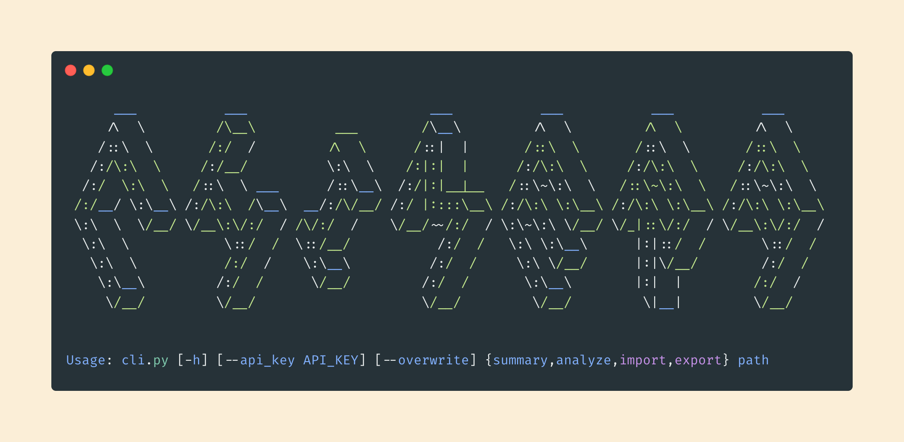
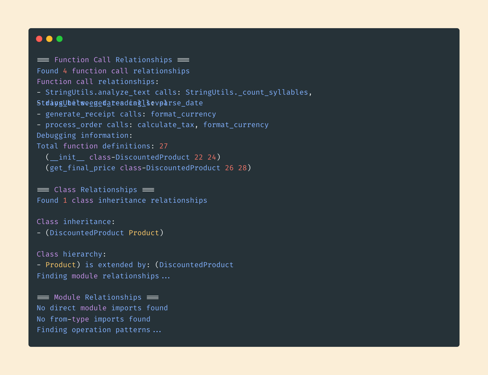
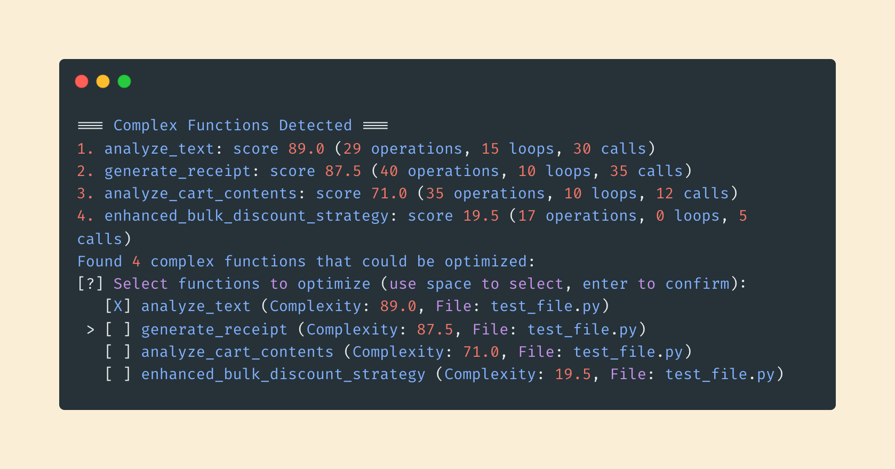
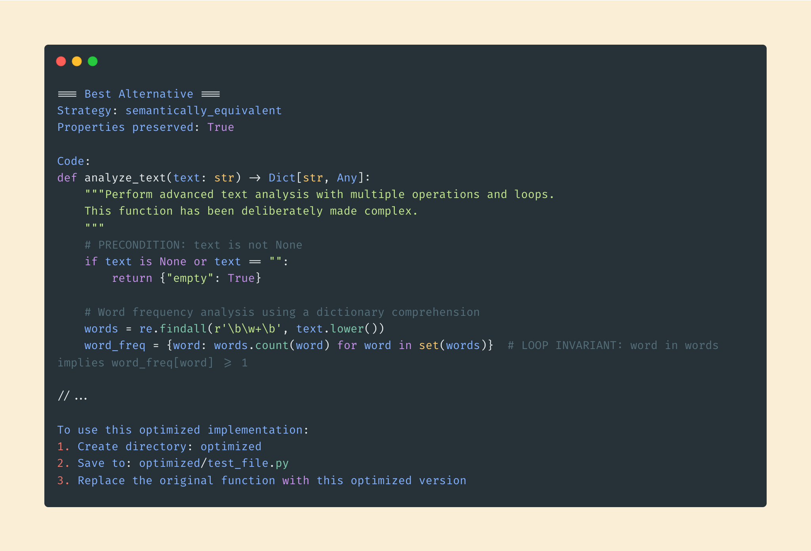
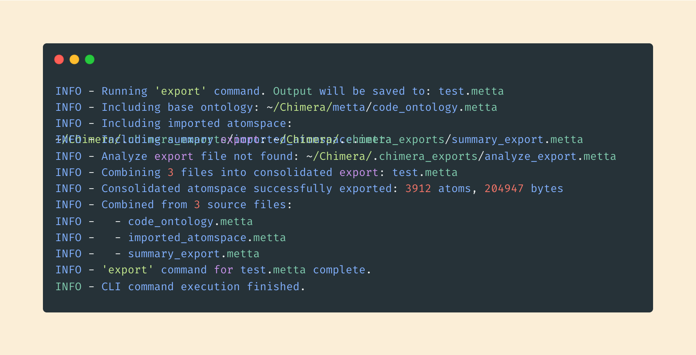
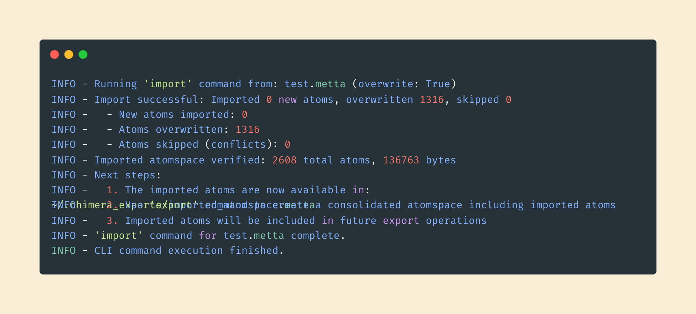
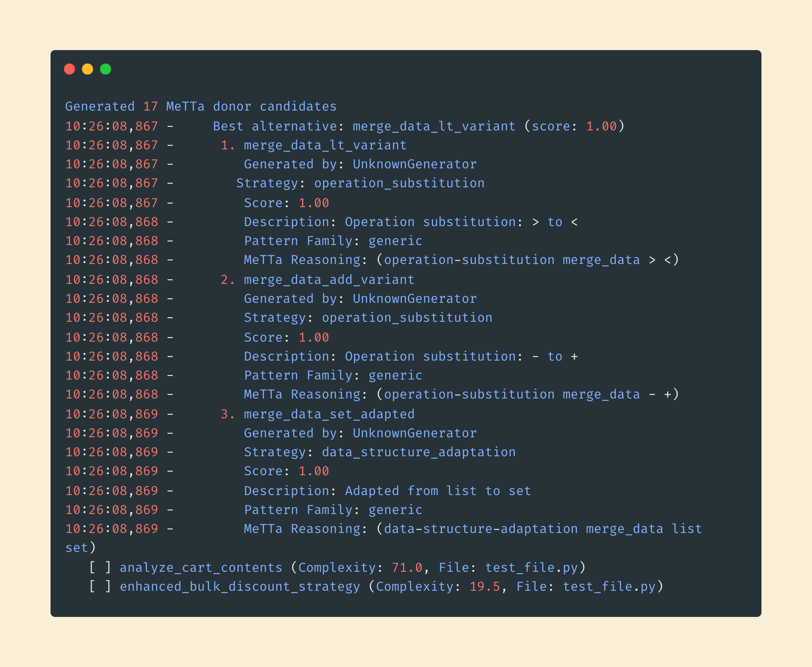
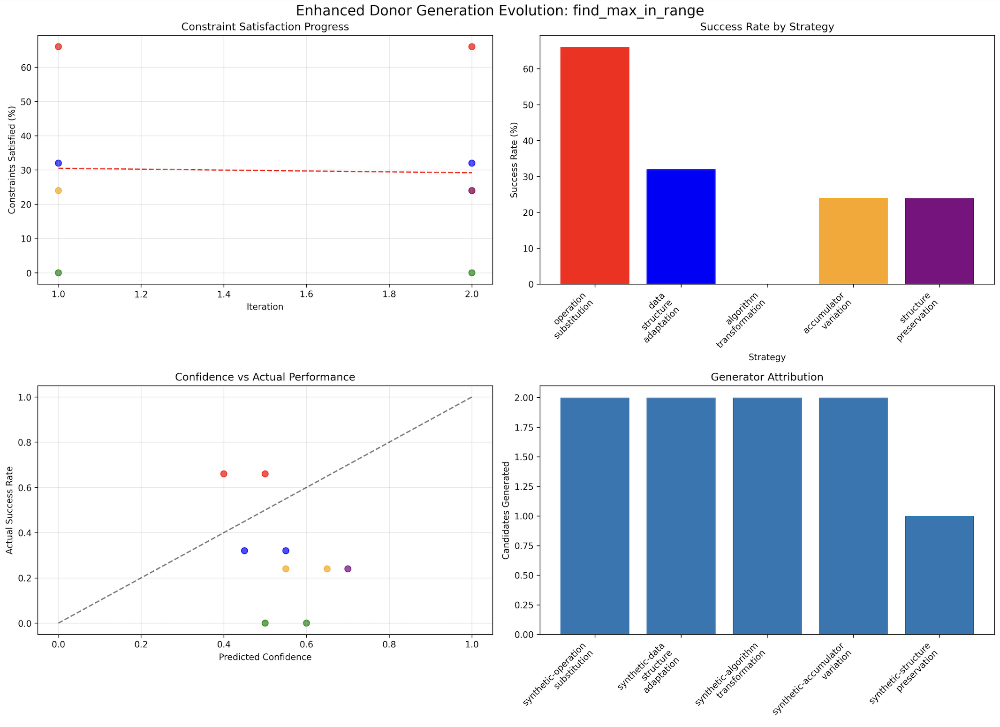

<div align="center">
  <a>
    
  </a>

  <h2 align="center">Chimera</h2> <div style="height:30px"></div>

  <p align="center">
Autonomous code evolution through symbolic reasoning and LLM inference
    <br />
    <br />
  </p>
</div>

Chimera is a research-driven software agent that autonomously evolves codebases using a hybrid reasoning engine, combining symbolic logic and statistical language models. Inspired by human-level programming workflows, Chimera can read, reason about, modify, and test software—learning and adapting iteratively.

This project aims to answer a bold question:

> Can a machine reason about and improve its own source code, autonomously, without predefined goals or human intervention?

Chimera bridges the gap between symbolic systems (using [MeTTa](https://metta-lang.dev/docs/learn/learn.html), theorem provers, and AST reasoning) and generative AI (e.g., GPT, Claude) to create a closed feedback loop for code understanding, editing, and validation.

**If you'd like to know more about how Chimera has been designed and how it pushes the goal of AGI forward, you can [read this](./DESIGN.md)**

[](./assets/help.png)

## Key Features

Chimera intends to implement the following features:

- [INFO] **Autonomous Evolution Loop:** Reads code, hypothesizes changes, tests outcomes, and learns from failure.
- [INFO] **Symbolic Reasoning Layer:** Uses logic and pattern-matching to identify structure, invariants, and design flaws.
- [INFO] **LLM-Augmented Inference:** Leverages language models to generate new code, fix errors, and explain intentions.
- [INFO] **Test-Aware Mutation:** Integrates with unit and integration tests to validate hypotheses and regressions.
- [INFO] **Memory and Self-Reflection:** Tracks past decisions and adapts future iterations accordingly.

--

## How to Run

Currently, due to the need for `pypy3.8` for `hyperon` and MeTTa, Chimera will only run on Linux distros. You'll need to clone this repo down:  

```bash
git clone https://github.com/ChimeraMetta/Chimera.git
```

You then have 2 options:

1. Run from Docker container
2. Build from source

If you don't want to go through the headache of dependency management, use the Docker container, for which you can just run the following 
script from the repo root:

```bash
sudo ./install.sh
```

You can now run the following commands:

```bash
chimera --help                                    # a help command
chimera summary file.py                           # analyzes and then provides a MeTTa summary of your file
chimera analyze file.py --api_key=OPENAI_API_KEY  # will perform complexity analysis and guide you through generating improved alternatives to your functions
chimera export file.metta                         # exports your current atomspace to a .metta file at the specified path
chimera import file.metta --overwrite             # imports an external .metta file into your atomspace
chimera query "What mitigations exist for ransomware?"  # natural language cybersecurity query
```

The `analyze` command takes an `--api_key` argument with an OpenAI API key, which is optional. If you supply it Chimera will 
generate full donor code from OpenAI, and if not the donor code will be composed using MeTTa only. Either way, MeTTa is used as 
a proof system.

The `import` command takes an `--overwrite` argument, which is also optional. This will overwrite your existing Atomspace with the 
one imported. If it is not provided, Chimera will only import atoms that are not already in your current Atomspace from the file specified.

--

## Current Features

### Summary

For its current phase, Chimera is able to statically analyze your code symbolically. It can be invoked through 

```sh
chimera summary file_to_summarize.py
```

which will provide a full summary of the relational ontology of your files and folders

[](./assets/summary.png)

### Complexity

You can also ask Chimera to improve your code by looking for complexity in the ontology and generate alternative 
candidates that simplify and improve its structure using

```sh
chimera analyze file_to_analyze.py --api_key=OPENAI_API_KEY
```

[](./assets/complexity.png)


This feature uses an LLM to generate alternative candidates that preserve the structure of your functions and their intent.


[](./assets/alternative.png)

### Export

You can export your Atomspace, containing all your MeTTa proofs and learned ontologies, to an external file as well

```sh
chimera export my_atomspace.metta
```

[](./assets/export.png)

This will allow you to reuse the Atomspace and its learnings in another context, or share it with others. Exporting your Atomspace 
exports __everything__, including your base code and proof ontologies.

### Import

Of course, you can't have an export command without being able to import the result.

```sh
chimera import your_atomspace.metta --overwrite # Overwrite flag is optional
```

[](./assets/import.png)

The `--overwrite` flag is optional and should be used with caution, since it will completely overwrite the current Atomspace 
your Chimera instance is using. This is useful for resetting your environment or for ensuring parity with someone else's environment.

### Generate

You can ask Chimera to generate alternative implementations for functions in your Python code using MeTTa-based reasoning only (without LLMs).

```sh
chimera generate path/to/your/file.py
```

This command will parse the specified Python file, identify functions, and then employ the modular MeTTa Donor Generator to create and suggest alternative code versions. The results, including the generated Python files for each alternative and a summary report, will be saved into a `metta_generation_results` directory in your project root. If you run the command without a file path, it will use a set of predefined internal functions as a demonstration.

[](./assets/generate.png)

### Visualize (Demonstration)

Chimera includes a command to visually demonstrate the donor generation and evolution process. This is primarily a tool for understanding how Chimera works internally.

```sh
chimera visualize
```

This command runs the donor generation process on a predefined example function (`find_max_in_range`). It will output logs detailing the steps, strategies used, and how candidates are evaluated. Additionally, it saves plots and detailed evolution data to an `evolution_plots` directory in your project root, allowing you to inspect the decision-making process.

[](./assets/visualize.png)

### Cybersecurity Query

Chimera includes a natural language cybersecurity threat intelligence query system. It uses sentence-transformer embeddings for intent classification and resolves entities directly from a MeTTa knowledge base — adding a new threat, vulnerability, or mitigation to the `.metta` ontology makes it automatically discoverable with no Python changes.

```sh
chimera query "What mitigations exist for ransomware?"
chimera query "How severe is SQL injection?"
chimera query "Tell me about CVE-2021-44228"
```

The system handles arbitrary paraphrased queries. All of the following resolve correctly:

```
"What defenses exist for phishing?"          → MITIGATION_ADVICE
"Can you explain what a rootkit does?"       → THREAT_LOOKUP
"Which threats pose the greatest danger?"    → SEVERITY_ASSESSMENT
"What attacks follow after SQL injection?"   → RELATIONSHIP_QUERY
"Details on Log4Shell"                       → VULNERABILITY_CHECK
```

#### SDK Usage

The query engine is also importable as a Python SDK:

```python
from cybersecurity_query import CyberSecurityQueryEngine

engine = CyberSecurityQueryEngine()
result = engine.query("What mitigations exist for ransomware?")
print(result.formatted_response)
```

The SDK provides a fluent builder API as well:

```python
from cybersecurity_query import QueryBuilder

result = (QueryBuilder()
    .threat("ransomware")
    .intent("mitigation")
    .execute())
```

#### Architecture

The NL parser uses a hybrid approach:

- **Intent Classification**: Sentence-transformer embeddings (`all-MiniLM-L6-v2`) classify query intent by cosine similarity to pre-embedded exemplar phrases — no regex patterns
- **Entity Resolution**: Entity vocabulary (threats, attack vectors, software, severity levels) is read from the MeTTa ontology at init time via `OntologyReader`
- **Reasoning Engine**: Generates MeTTa query plans and evaluates them against the cybersecurity ontology, with Python fallback for rule evaluation

--

## Next Phase

The next phase will be the implementation of the current features in an autonomous way to improve and heal code autonomously, in a live environment!